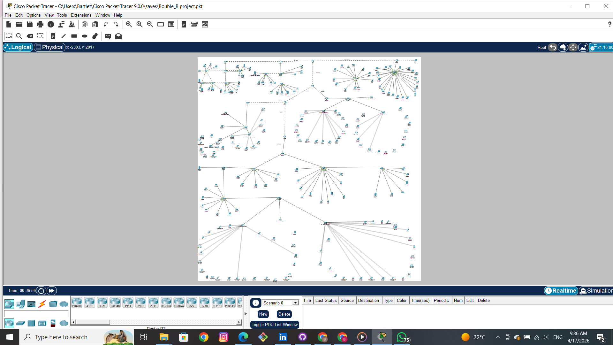
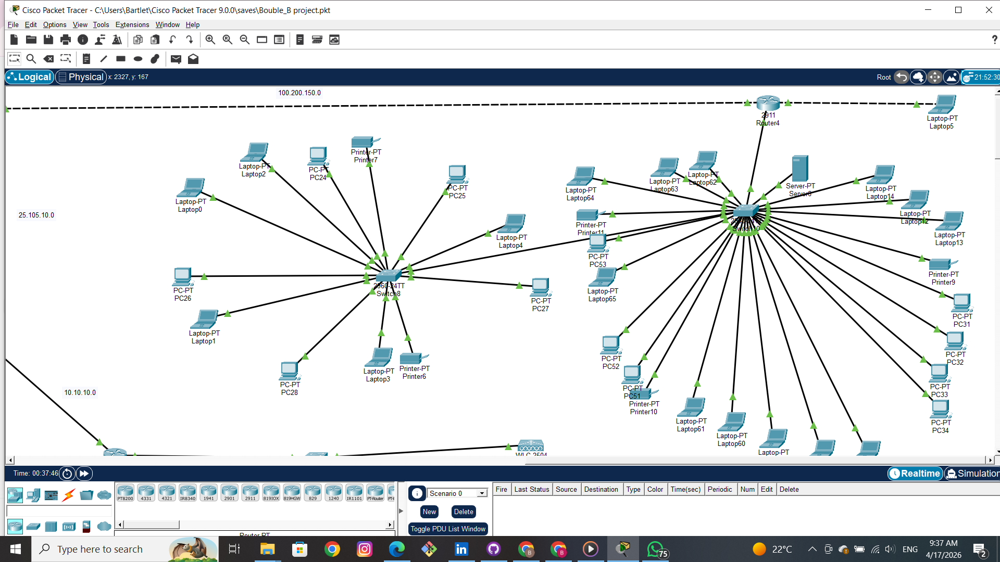
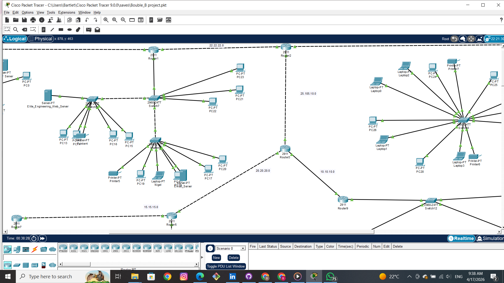
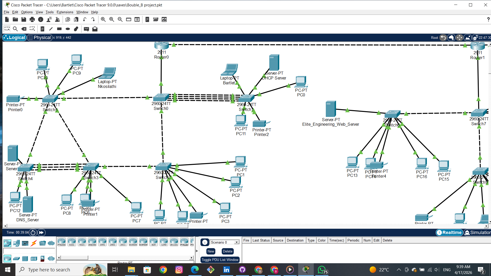
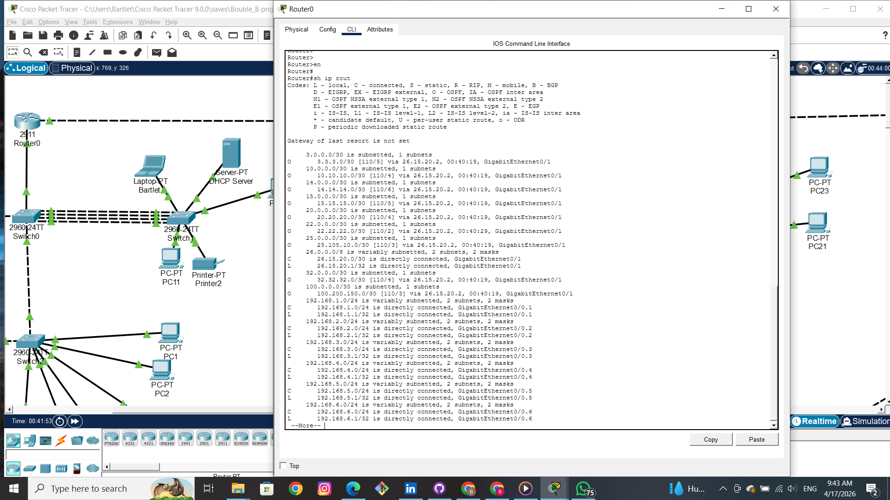

# 🌐 Enterprise Network Design (Packet Tracer)

## 📌 Overview
This project demonstrates a **large-scale enterprise network topology** designed using Cisco Packet Tracer.

It simulates a real-world enterprise environment with multiple departments, routing, switching, and network services.

---

## 🧠 Objectives
- Design a scalable enterprise network
- Implement routing and switching
- Configure network services (DHCP, servers)
- Ensure inter-network communication

---

## 🧰 Technologies Used
- Cisco Packet Tracer
- Routing (Static / Dynamic)
- Switching (VLANs)
- DHCP Configuration
- Server Deployment

---

## ⚙️ Features
- Multi-network topology
- VLAN segmentation
- Inter-VLAN routing
- DHCP server configuration
- End-to-end connectivity
- Scalable enterprise design

---

## 🖼️ Network Topology

---

## 📊 Additional Views

---

## 📂 Project Files

- `large-scale-network-topology.pkt` → Main Packet Tracer file

---

## 🚀 How to Run

1. Open Cisco Packet Tracer  
2. Load the `.pkt` file  
3. Start simulation  
4. Test connectivity between networks  

---

## 👤 Author
**Bartlet Mutsago**  
- Networking Enthusiast  
- Focus: Network Design, Automation, and Self-Healing Systems  

---

## 💡 Key Learning
This project demonstrates practical skills in:
- Network design
- Routing & switching
- Enterprise-level topology planning

---

# ⭐ If you like this project, give it a star!
